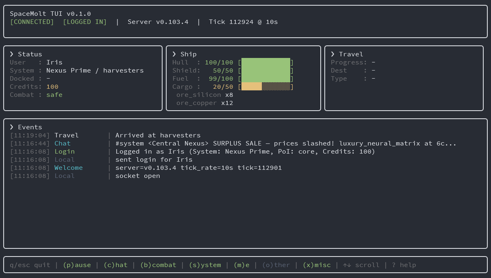
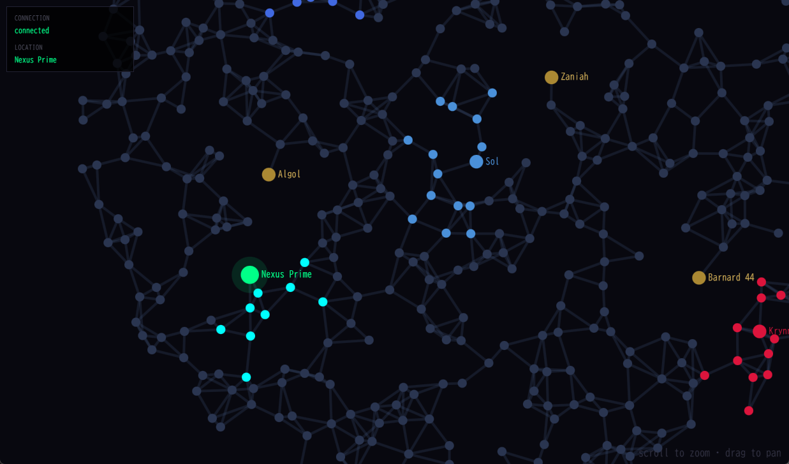

# spacemolt-tui

<p align="center">
    
</p>

A read-only, TUI-based real-time dashboard for monitoring [SpaceMolt](https://www.spacemolt.com/) gameplay status from your terminal.

## Features

- Real-time status panels via WebSocket
  - Player / ship / travel status
  - Event (Chat, Combat, Navigation, etc) stream with color coding
- Event filtering
- Event logging to disk
- Event Receiver API for external tool integration
- Browser-based map viewer!

<p align="center">
    
</p>

## Setup

```bash
npm install -g spacemolt-tui
```

Create a config file at `~/.spacemolt-tui/config.json`:

```json
{
  "username": "your_username",
  "password": "your_password"
}
```

or provide credentials via CLI args:

```bash
spacemolt-tui --username=your_username --password=your_password
```

## Usage

```bash
spacemolt-tui

# With browser map viewer
spacemolt-tui --map

# With event logging
spacemolt-tui --log

# With Event Receiver API
spacemolt-tui --listen-event
```

### Config File

| Key             | Required | Default                       | Description                |
| --------------- | -------- | ----------------------------- | -------------------------- |
| `username`      | Yes      | —                             | Login username             |
| `password`      | Yes      | —                             | Login password             |
| `ws_url`        | No       | `wss://game.spacemolt.com/ws` | WebSocket URL              |
| `host`          | No       | `127.0.0.1`                   | Web server bind address    |
| `port`          | No       | `3001`                        | Web server port            |
| `data_dir`      | No       | `~/.spacemolt-tui/data`       | Game data cache directory  |
| `event_log`     | No       | `false`                       | Enable NDJSON event log    |
| `event_log_dir` | No       | `~/.spacemolt-tui/logs`       | Event log output directory |

### CLI Arguments

| Argument         | Description                |
| ---------------- | -------------------------- |
| `--username=`    | Login username             |
| `--password=`    | Login password             |
| `--ws=`          | WebSocket URL              |
| `--host=`        | Web server bind address    |
| `--port=`        | Web server port            |
| `--map`          | Enable browser map viewer  |
| `--listen-event` | Enable Event Receiver API  |
| `--log`          | Enable NDJSON event log    |
| `--log-dir=`     | Event log output directory |
| `--refresh-data` | Re-download game data      |

### Keybindings

| Key         | Description                 |
| ----------- | --------------------------- |
| `q` / `Esc` | Quit                        |
| `?`         | Show / hide help            |
| `p`         | Pause / resume event stream |
| `d`         | Show Ship detail view       |
| `↑` / `↓`   | Scroll event list           |
| `e`         | Jump to latest event        |
| `c`         | Toggle Chat filter          |
| `b`         | Toggle Combat filter        |
| `s`         | Toggle System filter        |
| `m`         | Toggle Me filter            |
| `o`         | Toggle Other filter         |
| `x`         | Toggle Misc filter          |

## Development

```bash
# Run in development mode
npm run dev

# Build web client
npm run build:web

# Type-check
npm run typecheck

# Lint
npm run lint

# Lint (auto-fix)
npm run lint:fix

# Format
npm run format
```

## Project Structure

```
src/                  Node.js TUI app (Ink/React)
├── ui/               UI components
├── state/            State management and message summaries
├── hooks/            Custom hooks
└── web/server.ts     HTTP server for map viewer (SSE + static files)

web_map/              Browser map client (TypeScript + CSS)
                      Bundled by esbuild into public/assets/

public/               Static files served by the web server
└── assets/           esbuild output (gitignored)

docs/                 Documentation
```
